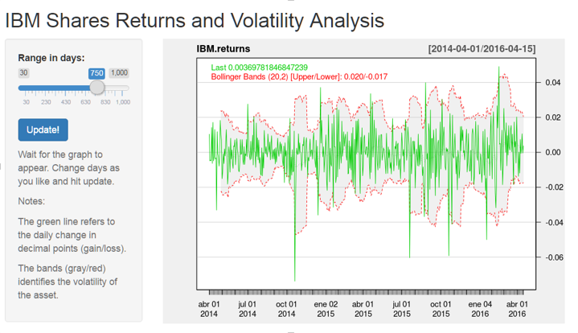
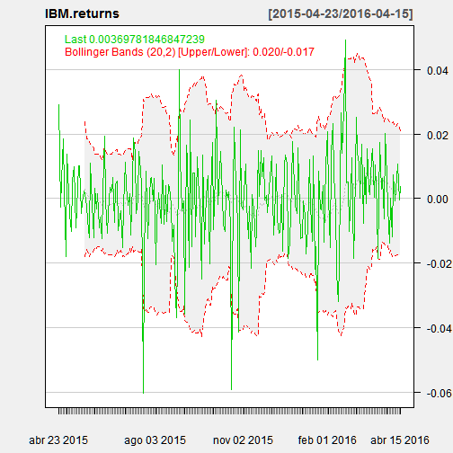

---
title       : Data Products Assignment 
subtitle    : IBM Shares Returns
author      : RMantovani 
job         : 
framework   : io2012        # {io2012, html5slides, shower, dzslides, ...}
highlighter : highlight.js  # {highlight.js, prettify, highlight}
hitheme     : tomorrow      # 
widgets     : [mathjax, quiz, bootstrap]  # {mathjax, quiz, bootstrap}
mode        : selfcontained # {standalone, draft}
knit        : slidify::knit2slides
--- .class #id p0

## Introduction

This presentation aims at introducing a Shiny application as part of assignments for the Data Products course from Coursera. The application has the following features:

1. It downloads IBM historical market data from Yahoo
2. It sets the number of days that will be presented in the graph 
3. It calculates the daily share's return
4. Ii shows the return information as a line graph
5. It adds a Bolinger Band (lines with two SD from the moving average)

--- .class #id p1

## Shiny App

The application is hosted in the shinyapps.io website. 

The objective of the application is to provide a sense of the profitability and volatility of IBM shares overtime  

[link to Shiny Application]( https://rcmantovani.shinyapps.io/IBMReturns) 

--- .class #id p2

## Shiny Application Overview 



1. Slider object to set the number of days (default is 360 days)
2. Button to update the graph with a new number of days 
3. Graph with adjusted closing results and Bolinger Bands 

--- .class #id p3
 
## Main code (calculations and graph) 


```r
library(quantmod)
data = getSymbols("IBM", from=Sys.Date()-360, to=Sys.Date(), auto.assign=TRUE)
IBM.returns <- diff(log(IBM$IBM.Adjusted))
chartSeries(IBM.returns , theme="white", type="candlesticks", TA=c(addVo(),addBBands())) 
```



--- .class #id p4
  


